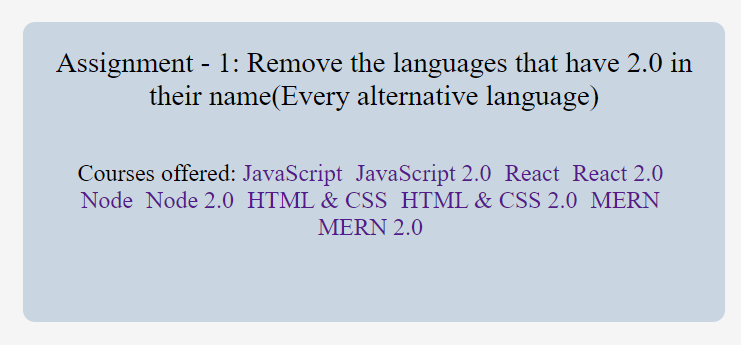

### Live Demo : [link](https://sm8uti.github.io/Ineuron-Full-JavaScript-2.0/DOM%20Projects/Project%207)

<br>

## DOM Assignments 7

<br>

### Task 1

<br>

#### Question : Remove the languages that have 2.0 in their name(Every alternative language)

<br>

#### After Image

<br>




<br>

#### Solution

```Javascript

const list1 = document.querySelectorAll(".main__languages a")

list1.forEach(e=>{if(e.innerText.includes("2.0")) e.style.display = "none";})

```

<br>

### Task 1

<br>

#### Question : Use JavaScript to write something in the input box and submit the form. This should refresh the page and the languages in the left card should come back

<br>

#### After Image

<br>


<br>

#### Solution

```Javascript

const formInput = document.querySelector(".main__form-input")
const formBtn = document.querySelector(".main__form-btn")

formInput.disabled = false;
formBtn.disabled = false;

formBtn.addEventListener("click",(event)=>{
    event.preventDefault()
    list1.forEach(e=>{
        e.style.display = "inline-block";
    })
})
```

