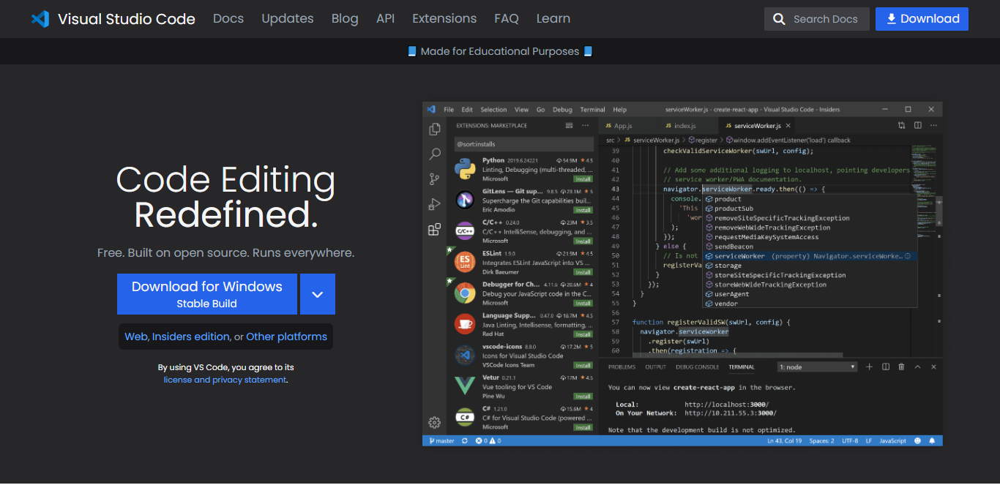

## Full Stack JavaScript 3.0 ( Project - 1 Tailwind )

### 💻 Website name : `VScode Website Clone`

In this project, I learned the Tailwind CSS framework. It is so popular framework and easy to make a responsive website. this framework uses different classes to design the website.

Tailwind CSS Document : [Link](https://tailwindcss.com/docs/installation)

VSCODE ORIGINAL WEBSITE : [Link](https://code.visualstudio.com/)

 

Time : 10 Hour 30 min

 

### 👨‍💻 Tech Stack

- HTML
- Tailwind CSS

 

### My Solution Link ( Responsive Version ): [Website Link](https://sm8uti.github.io/Ineuron-Full-JavaScript-2.0/Tailwind%20Projects/Vscode%20Clone/)

 

### ScreenShot

 

#### PC

